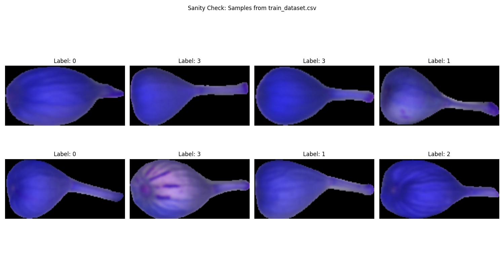

# 🧬 Hyperspectral Band Selection with Genetic Algorithm

This project uses genetic algorithms and deep learning to select optimal RGB band combinations from hyperspectral imaging data for toxin classification in figs. It leverages PyTorch, DEAP, and transfer learning with ResNet50.



## 📁 Project Structure

```
select-best-bands/
├── ga.py                      # Main genetic algorithm script
├── cnn/
│   ├── data_setup.py          # Data loading and preprocessing
│   ├── engine.py, engine2.py  # Training and evaluation utilities
│   ├── train.py               # CNN training script
│   ├── util/
│   │   └── helper_functions.py# Visualization and utilities
│   └── models/
│       └── checkpoint.pt      # Saved model checkpoint
├── data/
│   ├── interim/cropped-hypercubes/C0..C3/   # Raw hyperspectral patches
│   └── processed/train/test/C0..C3/         # Preprocessed data
├── train_dataset.csv          # Training data manifest
├── test_dataset.csv           # Test data manifest
├── pyproject.toml             # Dependencies
├── README.md                  # Project documentation
└── sanity_check/check_data.py # Data sanity check script
```

## � Features

- **Genetic Algorithm (GA):** Uses DEAP to optimize RGB band selection from hyperspectral cubes.
- **Deep Learning:** Transfer learning with ResNet50 for toxin classification.
- **Comprehensive Metrics:** Accuracy, precision, recall, F1, and confusion matrix.
- **Memory-Efficient:** Loads all data into RAM for fast training.
- **Modular Design:** Easily extendable for new models or data sources.

## ⚙️ Dependencies

Install with [uv](https://github.com/astral-sh/uv) or pip:

```bash
uv pip install -r pyproject.toml
```

Main packages:
- torch, torchvision, torcheval, torchinfo
- deap
- numpy, pandas, matplotlib, scikit-learn, tqdm

## 🏃 Usage

### Run Genetic Algorithm for Band Selection

```bash
uv run ga.py
```

### Train CNN Directly

```bash
uv run cnn/train.py
```

### Data Sanity Check

```bash
uv run sanity_check/check_data.py
```

## 🗂️ Data Format

- **train_dataset.csv / test_dataset.csv:** List `.npy` file paths and class labels.
- **Classes:** C0 (healthy), C1 (low toxin), C2 (medium toxin), C3 (high toxin).
- **Input:** Hyperspectral cubes, each with 448 bands.

## 🧩 How It Works

1. **GA Optimization:** Evolves band combinations, using CNN test accuracy as fitness.
2. **CNN Training:** ResNet50 fine-tuned on selected bands, with metrics tracked per epoch.
3. **Evaluation:** Best band set maximizes classification accuracy.

## � Results

- Outputs best RGB band indices and corresponding classification metrics.
- Model checkpoints saved in `cnn/models/`.


## 📬 Contact

For questions or contributions, open an issue or pull request.