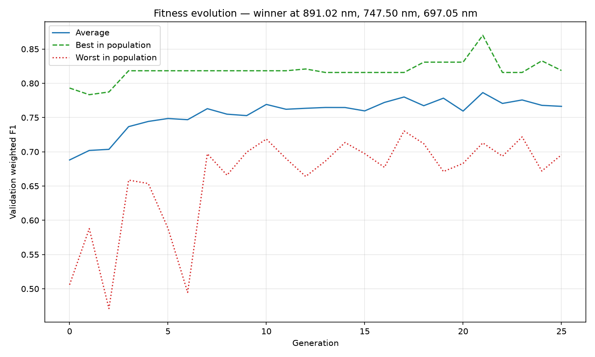

# 🧬 Hyperspectral band selection with a genetic algorithm

A genetic algorithm (DEAP) picks the best 3 of 448 hyperspectral bands for
aflatoxin classification in figs. Each band triplet is scored by fine-tuning a
ResNet50 on the RGB images those three bands produce.

The dataset is 1124 crops cut from 36 hyperspectral acquisitions of figs, in
four severity classes: healthy (C0), low (C1), medium (C2) and high (C3)
aflatoxin contamination. The spectral axis runs from 397.01 nm to 1004.52 nm in
448 bands.

## 🔬 The protocol, in plain words

The point of the protocol is that the number at the end is defensible: the test
set takes no part in choosing anything.

1. **The split is by acquisition, not by fig.** Crops of one acquisition are
   correlated — same fruit, same illumination, same day — so a crop of an
   acquisition on both sides of the split leaks. `split_dataset.py` groups by
   `acquisition_id` and stratifies by severity class: **28 acquisitions (868
   crops) for train, 8 (256 crops) held out for test**.
2. **Validation lives inside train.** The same grouped 80/20 is applied again
   inside the train side: **22 acquisitions (708 crops) to fit, 6 (160 crops) to
   validate**. The genetic algorithm only ever sees these two.
3. **Normalization is fitted on the train foreground.** Mean and standard
   deviation come from the foreground pixels of the 708 fitting crops — not from
   ImageNet's constants, and not from any crop the model is scored on.
4. **Fitness is the validation weighted F1.** Not accuracy, and never a test
   score. Each candidate trains a ResNet50 for 50 epochs under a seed derived
   from the triplet and from a checksum of the data it is trained on, so the
   same candidate always gets the same fitness.
5. **The final model reads the test set once.** `train_final.py` retrains the
   winning triplet on all 28 train acquisitions, saves the state dict, and only
   then opens the held-out crops, for a single inference. The script refuses to
   rewrite a recorded result under settings that would change it.
6. **The interval is over acquisitions.** `bootstrap.py` resamples whole test
   acquisitions 5000 times over the predictions already on disk (it runs no
   model and reads no crop) and reports the 95 % percentile interval of the
   weighted F1 — 8 acquisitions, so the interval is wide on purpose.

## 🚧 The v1 / v2 boundary: experiment 21

**Experiments 1–20 are the earlier protocol and their results do not hold.**
They split by fig instead of by acquisition, scored every candidate on the test
set, normalized with ImageNet's constants, seeded the RNG after drawing the
population, and mutated so weakly that the population collapsed to one
candidate. Their files stay in `out/` as part of the record, and the tools that
read them (`create_summary_table.py`) still do.

**Experiment 21 onwards is this protocol.** 21 is the replay of the 10 Sep 2026
search, so **the first new real run is 22**.

## 📁 Project structure

```
select-best-bands/
├── config.py                # every constant of the experiment, in one place
├── split_dataset.py         # the acquisition-grouped, stratified split
├── ga.py                    # the search, its on-disk cache, its outputs
├── train_final.py           # the final model and the single read of the test set
├── bootstrap.py             # the confidence interval, by acquisition
├── run.sh                   # the four steps above, chained, with logs
├── cnn/
│   ├── data_setup.py        # manifest, partition, NPZ, normalization, dataset
│   ├── engine.py            # the training and evaluation loops
│   └── model.py             # ResNet50, data identity, seeds, metrics
├── analyze_test_errors.py   # where the test errors fall, and what the crops look like
├── check_data.py            # NPZ checksums, once, and the per-class crop grid
├── create_summary_table.py  # summary of experiments 1–10 (v1 tool)
├── plot_fitness_evolution.py# redraws exp_NN_fitness_evolution.png from the tables
├── data/                    # gitignored
│   ├── cropped_hypercubes/  # symlink to the 1124 NPZ crops
│   ├── cropped_hypercubes.csv
│   ├── spectral_axes.csv
│   └── evaluation_partitions.csv   # written by split_dataset.py
├── out/                     # the experiment record, tracked in git
│   ├── tables/  figures/  logs/
│   └── models/              # the .pt checkpoints, gitignored (91 MB each)
├── sanity-check/            # data_sanity_check.png, written by check_data.py
├── tests/test_protocol.py   # the protocol tests: no GPU, no data/
├── init.sh                  # the verification gate
└── pyproject.toml           # pinned dependencies
```

**Every file of one experiment starts with its number**: experiment `NN` owns
`out/tables/exp_NN_*` and `out/figures/exp_NN_*`, and nothing else writes
there. A new run takes a new number; smoke runs take 90–99 and are deleted
afterwards. `ga.py` and `train_final.py` refuse a number that belongs to
someone else.

## 🔧 Prerequisites

- Python 3.13 (pinned in `.python-version`)
- A CUDA GPU (the runs below are on an A100)
- [uv](https://github.com/astral-sh/uv)
- The dataset in `data/` (gitignored: 1124 NPZ crops plus the two manifests)

## ⚙️ Installation and verification

```bash
uv sync        # installs the pinned versions, torch from the cu126 index
./init.sh      # the gate: compile, import, check the data files, run pytest
```

`./init.sh` is green when the imports work, the three data files are there (it
warns rather than fails when `data/` is absent, so code work is possible on a
machine without the dataset) and the protocol tests pass. Use
`SKIP_SYNC=1 ./init.sh` when the dependencies are already installed.

## 🏃 Running

### The whole chain

```bash
./run.sh 22
```

`run.sh N` runs `split_dataset.py`, then `ga.py N`, then `train_final.py N`,
then `bootstrap.py N`, logging each step to `out/logs/experiment_N.log`,
`final_N.log` and `bootstrap_N.log`. It defaults to `CUDA_VISIBLE_DEVICES=1`.

**A real run is hours on an A100** (an initial population of 20 plus 25
generations, each individual trained for 50 epochs, minus the cache hits), so
launch it detached:

```bash
nohup ./run.sh 22 > out/logs/run_22.log 2>&1 &
tail -f out/logs/experiment_22.log        # follow the search
wc -l out/tables/exp_22_candidates.csv    # one row per candidate evaluated so far
```

### One step at a time

```bash
uv run python split_dataset.py            # writes data/evaluation_partitions.csv
uv run python ga.py 22                    # the search
uv run python ga.py --evaluate 366 262 225  # score one triplet, write no exp_NN_ file
uv run python train_final.py 22           # the winner of exp_22_ga_summary.json
uv run python train_final.py 22 --bands 366 262 225
uv run python bootstrap.py 22             # the interval, from the predictions on disk
uv run python plot_fitness_evolution.py 22  # redraw the curve from the tables
uv run python analyze_test_errors.py 22   # where the test errors fall, no GPU
```

### Resuming

`ga.py` writes every candidate it evaluates to `out/tables/exp_NN_candidates.csv`
as it goes. Relaunching the same number restores that cache and re-runs the
search over it: everything already evaluated is a replay, and only the missing
candidates are trained. The cache refuses rows written under another data
identity, another seed or another fitness contract, so a resume that would not
reproduce the run stops instead of quietly mixing two runs.

`--no-evaluate` replays a finished search from a warm cache and trains nothing
— that is how experiment 21 reproduced the 10 Sep search without a GPU.

### A smoke chain

To check the code paths without spending hours, use a throwaway number and
delete its outputs afterwards:

```bash
./run.sh 99 --population 4 --generations 1 --epochs 1
rm -f out/tables/exp_99_* out/figures/exp_99_* out/models/exp_99_* out/logs/*_99.log
```

## ⚡ Configuration

Every constant lives in `config.py` — paths, class names, device, seeds,
partition proportions, GA parameters, CNN hyperparameters, bootstrap. Past
results depend on these values, so a change to them is a new experiment number,
never a re-run of an old one.

```python
# Partition
PARTITION_SEED = 20230717
TEST_PROPORTION = 0.2
VALIDATION_PROPORTION = 0.2

# Genetic algorithm
POPULATION_SIZE = 20
GENERATIONS = 25
CROSSOVER_PROBABILITY = 0.8    # blend crossover, alpha 0.5
MUTATION_PROBABILITY = 0.15    # gaussian, sigma 20, per-gene 0.3, then repaired
TOURNAMENT_SIZE = 3

# CNN
NUM_EPOCHS = 50                # no early stopping
BATCH_SIZE = 32
LEARNING_RATE = 0.001
IMAGE_SIZE = (64, 128)

# Bootstrap
BOOTSTRAP_RESAMPLES = 5000     # whole acquisitions, not crops
```

Every genetic operator is followed by a repair that guarantees three distinct
in-range bands without reordering them: that is what keeps the population from
collapsing, as it did in the 20 v1 studies.

## 📊 Results

### Experiment 21 — the current protocol

Winner: bands **366 / 262 / 225** = 891.02 / 747.50 / 697.05 nm.

| | weighted F1 | macro F1 | ordinal MAE | QWK |
|---|---|---|---|---|
| Validation (fitness of the winner) | 0.8701 | 0.8764 | 0.1875 | 0.8711 |
| **Held-out test** (256 crops, 8 acquisitions, read once) | **0.7221** | 0.7224 | 0.5000 | 0.5815 |

Bootstrap over acquisitions: **0.722, 95 % CI [0.645, 0.848]** (5000 resamples).
The interval is wide because it resamples 8 acquisitions, and two of them carry
most of the spread: both score weighted F1 0.689 (accuracy 0.53) against 0.857
to 0.951 (accuracy 0.75 to 0.91) for the other six.



Search: the initial population plus 25 generations (26 rows in `exp_21_ga_stats.csv`),
383 unique candidates evaluated, 451 cache hits.
Its files are `out/tables/exp_21_*` and `out/figures/exp_21_*`.

### Experiments 1–20 — the earlier protocol

Their tables are in `out/tables/exp_01_*` … `exp_20_*` and
`out/tables/exp_01_10_metrics.csv`. **Their numbers are not comparable with
experiment 21 and are not defensible** — see the v1 / v2 boundary above. They
are kept because they are part of the record of the work.

## 🧪 Tests

```bash
uv run pytest -q
```

`tests/test_protocol.py` watches what makes the result defensible — which crops
each step sees, which values come out, what is refused — and nothing about how
it is written. It needs no GPU and no `data/`: the reference manifests it checks
against are versioned in `tests/data/`.

## 📋 License

This project is part of ongoing research. Please contact me for usage
permissions and cite appropriately in academic work.

## 📬 Contact

For research collaboration or technical questions, please open an issue with
detailed information.
