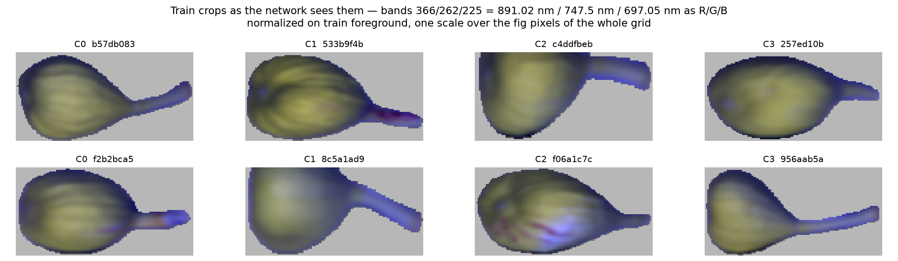
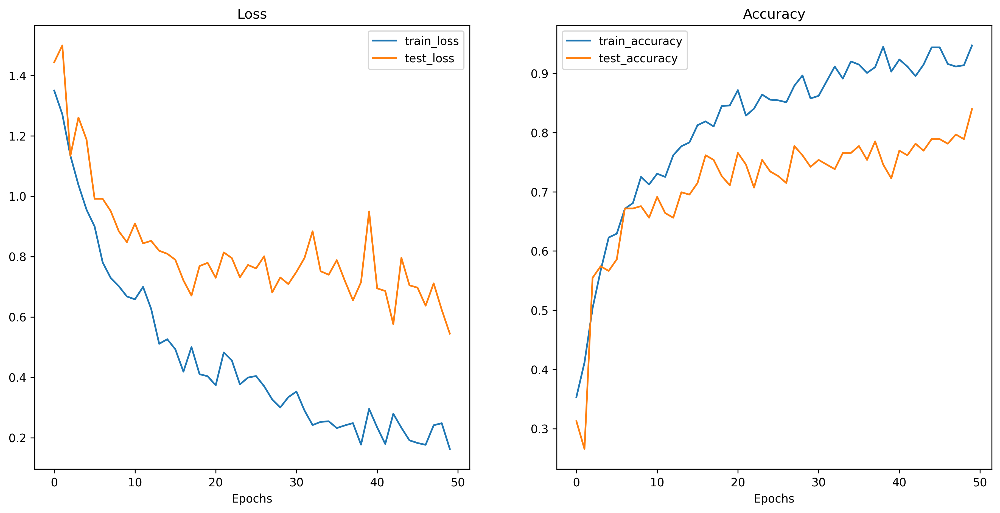

# 🧬 Hyperspectral Band Selection with Genetic Algorithm

This project implements a genetic algorithm-based approach to optimize RGB band selection from hyperspectral imaging data for toxin classification in figs. The system combines evolutionary optimization with deep learning to identify the most informative spectral bands for distinguishing between different toxin contamination levels.

## 🔬 Research Context

Hyperspectral imaging captures data across hundreds of spectral bands, but many are redundant for specific classification tasks. This project addresses the challenge of selecting optimal band combinations that maximize classification accuracy while reducing computational complexity. The application focuses on detecting aflatoxin contamination in figs, with four classification levels: healthy (C0), low toxin (C1), medium toxin (C2), and high toxin (C3).



## ✨ Features

- **Genetic Algorithm Optimization:** Uses DEAP framework to evolve optimal RGB band combinations from 448 hyperspectral bands
- **Transfer Learning:** ResNet50 pre-trained model fine-tuned for toxin classification
- **Basic Evaluation Metrics:** Tracks training/test loss and accuracy across epochs
- **Memory Optimization:** Efficient data loading strategy for large hyperspectral datasets
- **Experiment Management:** Support for multiple experimental runs with detailed logging
- **Modular Architecture:** Clean separation between GA optimization and CNN training components

## 📁 Project Structure

```
select-best-bands/
├── ga.py                      # Main genetic algorithm script
├── check_data.py              # Data validation and sanity checks  
├── cnn/
│   ├── data_setup.py          # Data loading and preprocessing
│   ├── engine.py              # Training and evaluation utilities
│   ├── train.py               # CNN training script (used by GA)
│   └── util/
│       └── helper_functions.py# Visualization and utilities
├── data/                      # Hyperspectral data (excluded from git)
│   ├── interim/
│   │   └── cropped-hypercubes/# Raw hyperspectral patches (C0-C3)
│   └── processed/
│       ├── train/             # Training data (C0-C3)
│       └── test/              # Test data (C0-C3)
├── out/                       # Experiment outputs
│   ├── logs/                  # Experiment log files
│   ├── figures/               # Generated plots and visualizations
│   └── tables/                # Results CSV files
├── sanity-check/
│   └── data_sanity_check.png  # Data visualization output
├── train_dataset.csv          # Training data manifest (898 samples)
├── test_dataset.csv           # Test data manifest
├── pyproject.toml             # Project dependencies and configuration
├── uv.lock                    # Dependency lock file
└── README.md                  # Project documentation
```

## 🔧 Prerequisites

- Python 3.13+
- CUDA-capable GPU
- At least 16GB RAM
- [uv](https://github.com/astral-sh/uv) package manager (recommended)

## ⚙️ Installation

### Option 1: Using uv (Recommended)

```bash
# Install uv if you haven't already
curl -LsSf https://astral.sh/uv/install.sh | sh

# Clone the repository
git clone <repository-url>
cd select-best-bands

# Install dependencies
uv sync
```

### Option 2: Using pip

```bash
# Clone the repository
git clone <repository-url>
cd select-best-bands

# Create virtual environment
python -m venv venv
source venv/bin/activate  # On Windows: venv\Scripts\activate

# Install dependencies
pip install -e .
```

## 📦 Dependencies

Core packages automatically installed:
- **PyTorch Ecosystem:** torch, torchvision, torcheval, torchinfo
- **Genetic Algorithm:** deap
- **Data Science:** numpy, pandas, matplotlib, scikit-learn
- **Utilities:** tqdm, pillow, requests

## 🗂️ Data Format

### CSV Structure
- **Files:** `train_dataset.csv` (898 samples), `test_dataset.csv`
- **Columns:** `filepath` (path to .npy file), `label` (numeric: 0, 1, 2, 3)
- **Example:**
  ```csv
  filepath,label
  data/processed/train/C0/sample_001.npy,0
  data/processed/train/C1/sample_002.npy,1
  ```

### Hyperspectral Data
- **Format:** NumPy arrays (`.npy` files)
- **Shape:** `(height, width, 448)` - 448 spectral bands
- **Data Type:** Float32, normalized pixel intensities
- **Classes (numeric labels in CSV):** 
  - **0 (C0):** Healthy figs (no toxin contamination)
  - **1 (C1):** Low toxin contamination
  - **2 (C2):** Medium toxin contamination  
  - **3 (C3):** High toxin contamination

## ⚡ Configuration

### GA Parameters (in `ga.py`)

```python
# Population and Evolution
POPULATION_SIZE = 20        # Size of each generation
GENERATIONS = 50           # Number of evolutionary cycles
CROSSOVER_PROB = 0.8       # Probability of crossover
MUTATION_PROB = 0.15       # Probability of mutation
ELITISM_SIZE = 1           # Number of best individuals preserved

# CNN Training
BATCH_SIZE = 32
LEARNING_RATE = 0.001
NUM_EPOCHS = 50

# Hyperspectral Bands
START_BAND = 0             # First band index
END_BAND = 447             # Last band index (448 total bands)
```

## 🏃 Usage

### Genetic Algorithm for Band Selection

Run the main optimization process (default: 5 experiments):

```bash
uv run ga.py
```

### Background Execution

For long-running experiments with logging:

```bash
nohup uv run python -u ga.py > out/logs/experiment_1.log 2>&1 &
```

## 📊 Experimental Results

### Latest Results (Experiment 01)
- **Best Band Combination:** [126, 78, 186] (R, G, B indices from 448 bands)
- **Final Test Accuracy:** 83.98% (0.8398)
- **Final Training Accuracy:** 94.72% (0.9472)
- **Final Training Loss:** 0.163
- **Final Test Loss:** 0.544

### Evolution Progress
- **Initial Generation (Gen 0):** Best fitness 79.3% with bands [225, 101, 369]
- **Mid Evolution (Gen 25):** Best fitness 81.6% with bands [139, 71, 197]  
- **Final Generation (Gen 50):** Best fitness 83.98% with bands [126, 78, 186]
- **Population Convergence:** Final generation showed 100% convergence to optimal solution

### Output Files Generated
- **GA Statistics:** `out/tables/exp_01_ga_stats.csv` - Evolution metrics per generation
- **Best CNN Results:** `out/tables/exp_01_cnn_results_126_78_186.csv` - Final training metrics
- **Visualization:** `out/figures/exp_001_cnn_results_126_78_186.png` - Loss/accuracy curves
- **Full Log:** `out/logs/experiment_1.log` - Complete execution details

### Detailed Results Tables

#### Final CNN Performance (Best Individual)
|train_loss|train_acc|test_loss   |test_acc            |
|----------|---------|------------|--------------------|
|0.1626397494612069|0.947198275862069|0.5444981418331736|0.83984375          |


#### GA Evolution Statistics (Complete)
|gen|nevals|avg         |std                 |min       |max       |best           |
|---|------|------------|--------------------|----------|----------|---------------|
|0  |20    |0.688671875 |0.06548184721320195 |0.5625    |0.79296875|[225, 101, 369]|
|1  |19    |0.719140625 |0.05352987948843967 |0.53515625|0.78125   |[225, 101, 369]|
|2  |13    |0.7365234375|0.028450669812729697|0.68359375|0.77734375|[225, 101, 369]|
|3  |13    |0.7486328125|0.032548111736884495|0.65625   |0.78125   |[225, 101, 369]|
|4  |18    |0.7244140625|0.06322184470536445 |0.53515625|0.7890625 |[225, 101, 369]|
|5  |18    |0.76015625  |0.03352099680144521 |0.69140625|0.8125    |[178, 91, 315] |
|6  |18    |0.7494140625|0.034149540276176754|0.6640625 |0.7890625 |[178, 91, 315] |
|7  |16    |0.7310546875|0.04112290657072064 |0.6484375 |0.7890625 |[178, 91, 315] |
|8  |14    |0.732421875 |0.036109050463708194|0.66015625|0.7890625 |[178, 91, 315] |
|9  |17    |0.7373046875|0.034140602653024724|0.640625  |0.77734375|[178, 91, 315] |
|10 |20    |0.7451171875|0.039757009595940675|0.65625   |0.79296875|[178, 91, 315] |
|11 |17    |0.76875     |0.026133951068246453|0.68359375|0.80859375|[178, 91, 315] |
|12 |17    |0.7564453125|0.03714584967327062 |0.6875    |0.80859375|[178, 91, 315] |
|13 |17    |0.748046875 |0.036612629230097976|0.66015625|0.796875  |[178, 91, 315] |
|14 |16    |0.748046875 |0.0560720383643053  |0.5859375 |0.8203125 |[139, 71, 197] |
|15 |16    |0.7623046875|0.03920433235361838 |0.6796875 |0.80078125|[139, 71, 197] |
|16 |15    |0.780078125 |0.030859375         |0.6796875 |0.80859375|[139, 71, 197] |
|17 |19    |0.7625      |0.03594174567312014 |0.67578125|0.80078125|[139, 71, 197] |
|18 |18    |0.7716796875|0.02571828841285358 |0.7265625 |0.80078125|[139, 71, 197] |
|19 |17    |0.766796875 |0.03125             |0.6875    |0.80078125|[139, 71, 197] |
|20 |16    |0.7708984375|0.02671275252477065 |0.72265625|0.80078125|[139, 71, 197] |
|21 |18    |0.7611328125|0.030715711570975045|0.68359375|0.80078125|[139, 71, 197] |
|22 |15    |0.77421875  |0.024609375         |0.7109375 |0.80078125|[139, 71, 197] |
|23 |18    |0.7794921875|0.02027027027027027 |0.734375  |0.80078125|[139, 71, 197] |
|24 |16    |0.77734375  |0.017578125         |0.734375  |0.80078125|[139, 71, 197] |
|25 |18    |0.81640625  |0.0                 |0.81640625|0.81640625|[139, 71, 197] |
|26 |15    |0.8140625   |0.013020833333333333|0.78515625|0.8203125 |[139, 71, 197] |
|27 |17    |0.810546875 |0.015625            |0.76171875|0.8203125 |[139, 71, 197] |
|28 |19    |0.814453125 |0.013671875         |0.78515625|0.8203125 |[139, 71, 197] |
|29 |17    |0.8125      |0.01171875          |0.79296875|0.8203125 |[139, 71, 197] |
|30 |14    |0.814453125 |0.01171875          |0.796875  |0.8203125 |[139, 71, 197] |
|31 |19    |0.806640625 |0.022265625         |0.76953125|0.8203125 |[139, 71, 197] |
|32 |19    |0.8193359375|0.01139322916666667 |0.8046875 |0.8359375 |[139, 71, 197] |
|33 |18    |0.8142578125|0.015039062499999999|0.7890625 |0.8359375 |[139, 71, 197] |
|34 |16    |0.8203125   |0.0078125           |0.8046875 |0.8359375 |[139, 71, 197] |
|35 |16    |0.82421875  |0.00390625          |0.81640625|0.8359375 |[139, 71, 197] |
|36 |17    |0.8291015625|0.007324218749999999|0.8125    |0.8359375 |[139, 71, 197] |
|37 |17    |0.827734375 |0.009765625         |0.8046875 |0.8359375 |[139, 71, 197] |
|38 |17    |0.82734375  |0.005859375         |0.8125    |0.8359375 |[139, 71, 197] |
|39 |17    |0.8291015625|0.009765625         |0.8046875 |0.8359375 |[139, 71, 197] |
|40 |17    |0.8306640625|0.009765625         |0.8046875 |0.8359375 |[139, 71, 197] |
|41 |19    |0.8291015625|0.01171875          |0.8046875 |0.8359375 |[139, 71, 197] |
|42 |16    |0.8306640625|0.013671875         |0.80078125|0.8359375 |[139, 71, 197] |
|43 |16    |0.8359375   |0.01171875          |0.80078125|0.83984375|[126, 78, 186] |
|44 |20    |0.830078125 |0.01691455866766482 |0.80078125|0.83984375|[126, 78, 186] |
|45 |16    |0.8359375   |0.01171875          |0.80078125|0.83984375|[126, 78, 186] |
|46 |16    |0.83828125  |0.006810779599282302|0.80859375|0.83984375|[126, 78, 186] |
|47 |16    |0.8359375   |0.01171875          |0.80078125|0.83984375|[126, 78, 186] |
|48 |19    |0.83984375  |0.0                 |0.83984375|0.83984375|[126, 78, 186] |
|49 |16    |0.8310546875|0.015716286073663165|0.80078125|0.83984375|[126, 78, 186] |
|50 |18    |0.83203125  |0.015625            |0.80078125|0.83984375|[126, 78, 186] |


### Visualization

*Loss and accuracy curves for the best band combination [126, 78, 186] over 50 training epochs*

## 🧩 Algorithm Workflow

### 1. Initialization
- Generate random population of band combinations (triplets for RGB)
- Each individual represents 3 band indices from 448 available bands

### 2. Fitness Evaluation
- Convert hyperspectral data to RGB using selected bands
- Train ResNet50 with fine tuning on converted images
- Use test accuracy as fitness score

### 3. Evolution Process
- **Selection:** Tournament selection of parent individuals
- **Crossover:** Blend crossover to create offspring with clamped values
- **Mutation:** Random band replacement with low probability
- **Elitism:** Preserve best individuals across generations

### 4. Convergence
- Continue evolution for specified generations
- Track and save best-performing band combinations
- Output optimal RGB mapping and basic accuracy metrics

## 📋 License

This project is part of ongoing research. Please contact the authors for usage permissions and cite appropriately in academic work.

## 📬 Contact

For research collaboration or technical questions, please open an issue with detailed information.

